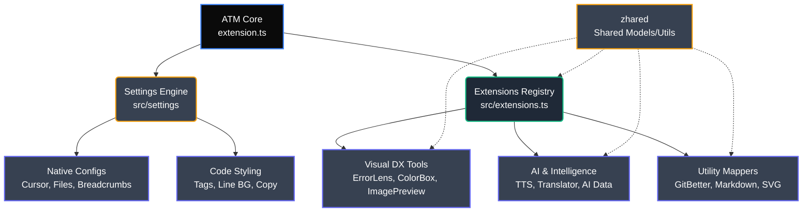

## 📐 Architecture

ATM follows a strict modular architecture where each extension is an independent module with its own `core/` (business logic) and `ui/` (presentation) layers.

```text
src/
├── extension.ts            ← Entry point
├── extensions/
│   ├── extensions.ts       ← Central registry
│   ├── ai-data-id/         ← 🧠  AI data & consumption
│   ├── code-spell/         ← 🔍  Spell checker
│   ├── color-box/          ← 🎨  Color decorations
│   ├── color-debugging/    ← 🐛  Debug colors
│   ├── comments-code/      ← ✅  TODO/FIXME indexer
│   ├── env-lens/           ← 🔐  Secure .env visibility
│   ├── error-lens/         ← ⛔  Inline diagnostics
│   ├── git-better/         ← 🔗  Git blame + GitHub tools
│   ├── image-preview/      ← 🖼️  Gutter previews
│   ├── markdown-mdx/       ← 📝  MDX support
│   ├── markdown-md/        ← 📄  Markdown preview enhancements
│   ├── screenshot-code/    ← 📸  Code screenshots
│   ├── svg-better/         ← ⚡  SVG optimizer
│   ├── translate-doc/      ← 🌐  Translation engine
│   ├── version-package/    ← 📦  Dependency checker
│   ├── voice-tts/          ← 🔊  Text-to-speech
│   └── zhared/             ← 🛠️  Shared utilities & models
└── settings/
    ├── code/               ← Editor styling & coding enhancements
    │   ├── auto-tag-x2/    ← 🏷️  Auto‑close/rename HTML/JSX tags
    │   ├── color-bg-tag/   ← 🟩  HTML tag background colors
    │   ├── copy-tag/       ← 📋  Copy highlight animations
    │   └── line-bg-tag/    ← ➖  Current line styling
    └── native/             ← Native VS Code config overrides
        ├── breadcrumbs/    ← 🍞  Breadcrumbs navigation tweaks
        ├── cursor/         ← 🖱️  Cursor animations & styles
        └── files/          ← 📂  File explorer configuration
```

## 🧠 System Workflow

The following diagram illustrates how the ATM toolkit is instantiated and how it handles dependencies internally without bloating the editor:



**Key Highlights:**
* **Lazy Loading & Performance:** Through the `extensions.ts` central registry, each module manages its own subscription. Memory leaks are avoided by ensuring every module registers its disposables correctly.
* **Independent Modules:** Extensions inside `src/extensions` don't depend on each other (with the exception of `zhared`), which means a visual bug in `color-box` will never crash `voice-tts`. 
* **Native Enhancements:** The `settings` module actively rewrites workspace configurations to provide a "Cursor IDE-like" feeling immediately upon activation.
