<div align="center">
  
  <!--  -->
</div>

<p align="center">
  &nbsp;
  &nbsp;
  &nbsp;
  <a href="https://github.com/bastndev/ATM"></a>
</p>

<p align="center">
  <a href="./public/docs/README_ES.md">Español 🇪🇸</a> |
  <a href="./public/docs/README_ZH.md">中文 🇨🇳</a>
</p>

<br>

| `Icon`                                                                             | `Code/Name`                                | `Description`                                                                                          | `SIZE` |
| ---------------------------------------------------------------------------------- | ------------------------------------------ | ------------------------------------------------------------------------------------------------------ | ------ |
|  | [AI Data](https://github.com/bastndev/ATM) | Monitorea y muestra el consumo de datos de la IA (Antigravity) con tooltip informativo en tiempo real. | 12KB   |

<details>
<summary>Tutorial GIF</summary>


</details>

|                                                                                    |                                               |                                                                                                                               |      |
| ---------------------------------------------------------------------------------- | --------------------------------------------- | ----------------------------------------------------------------------------------------------------------------------------- | ---- |
| 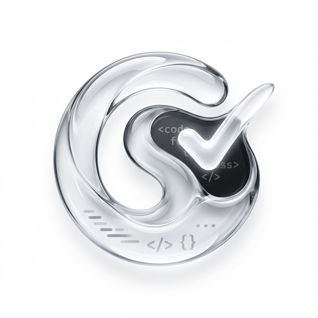 | [Code Spell](https://github.com/bastndev/ATM) | Corrector ortografico para codigo con diccionario en ingles, terminos tecnicos, acciones rapidas y exclusiones configurables. | 12KB |

<details>
<summary>Tutorial VIDEO</summary>

<video controls autoplay muted loop src="./public/github/video/v-code-spell.mp4" width="100%"></video>

</details>

|                                                                                         |                                                    |                                                                                                        |      |
| --------------------------------------------------------------------------------------- | -------------------------------------------------- | ------------------------------------------------------------------------------------------------------ | ---- |
| 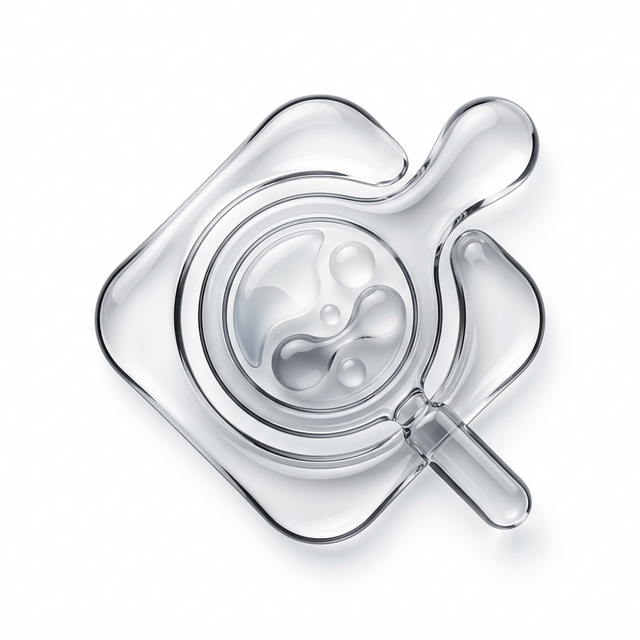 | [Color Debugging](https://github.com/bastndev/ATM) | Herramientas de depuracion visual de colores con gestion de estado y controles desde la barra inferior | 12KB |

<details>
<summary>Tutorial VIDEO</summary>

<video controls autoplay muted loop src="./public/github/video/v-color-debugging.mp4" width="100%"></video>

</details>

|                                                                                     |                                                  |                                                                                                              |      |
| ----------------------------------------------------------------------------------- | ------------------------------------------------ | ------------------------------------------------------------------------------------------------------------ | ---- |
| 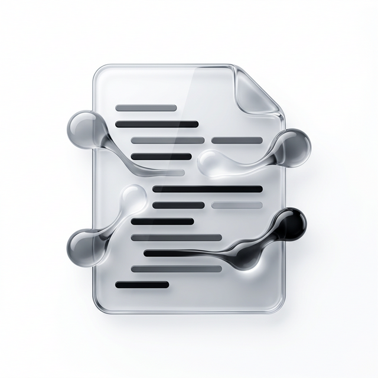 | [Comments Code](https://github.com/bastndev/ATM) | Mejora la lectura de comentarios con decoraciones visuales, control por lenguaje y actualizacion optimizada. | 12KB |

<details>
<summary>Tutorial VIDEO</summary>

<video controls autoplay muted loop src="./public/github/video/v-comments-code.mp4" width="100%"></video>

</details>

|                                                                                |                                             |                                                                                                                 |      |
| ------------------------------------------------------------------------------ | ------------------------------------------- | --------------------------------------------------------------------------------------------------------------- | ---- |
| 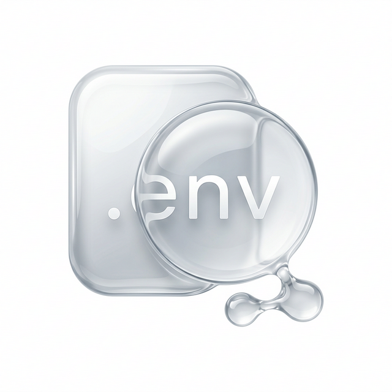 | [Env Lens](https://github.com/bastndev/ATM) | Parsea archivos .env y oculta valores con BLUR seguro (ocultar/mostrar temporal) mediante decoraciones y hover. | 12KB |

<details>
<summary>Tutorial VIDEO</summary>

<video controls autoplay muted loop src="./public/github/video/v-env-lens.mp4" width="100%"></video>

</details>

|                                                                                  |                                               |                                                                                                               |      |
| -------------------------------------------------------------------------------- | --------------------------------------------- | ------------------------------------------------------------------------------------------------------------- | ---- |
|  | [Error Lens](https://github.com/bastndev/ATM) | Muestra errores y advertencias directamente en linea para acelerar la deteccion y correccion de diagnosticos. | 12KB |

<details>
<summary>Tutorial VIDEO</summary>

<video controls autoplay muted loop src="./public/github/video/v-error-lens.mp4" width="100%"></video>

</details>

|                                                                                  |                                               |                                                                                                   |      |
| -------------------------------------------------------------------------------- | --------------------------------------------- | ------------------------------------------------------------------------------------------------- | ---- |
| 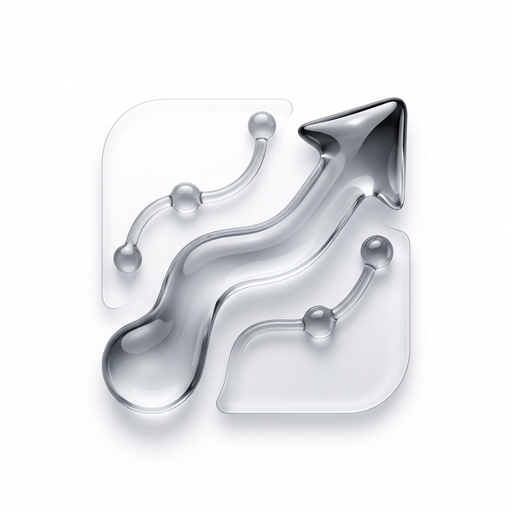 | [Git Better](https://github.com/bastndev/ATM) | Panel Git mejorado con vista mini-blame y herramientas visuales para revisar historial y cambios. | 12KB |

<details>
<summary>Tutorial VIDEO</summary>

<video controls autoplay muted loop src="./public/github/video/v-git-better.mp4" width="100%"></video>

</details>

|                                                                                     |                                                  |                                                                                        |      |
| ----------------------------------------------------------------------------------- | ------------------------------------------------ | -------------------------------------------------------------------------------------- | ---- |
| 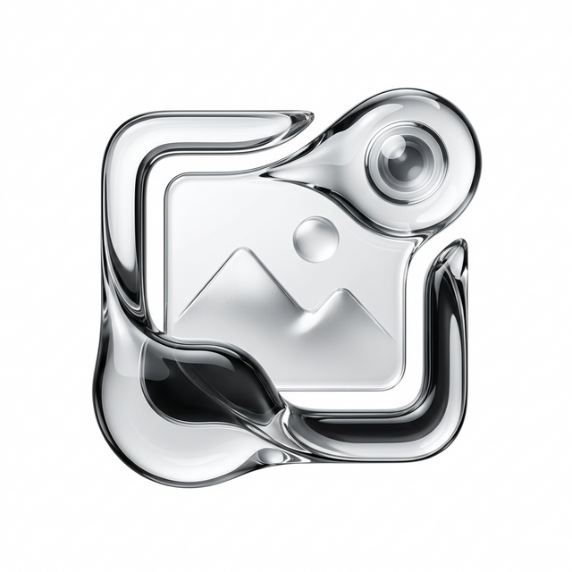 | [Image Preview](https://github.com/bastndev/ATM) | Previsualiza imagenes con datos de tamaño peso en el codigo directamente en el editor. | 12KB |

<details>
<summary>Tutorial VIDEO</summary>

<video controls autoplay muted loop src="./public/github/video/v-image-preview.mp4" width="100%"></video>

</details>

|                                                                                     |                                                  |                                                                                                                                                                      |      |
| ----------------------------------------------------------------------------------- | ------------------------------------------------ | -------------------------------------------------------------------------------------------------------------------------------------------------------------------- | ---- |
| 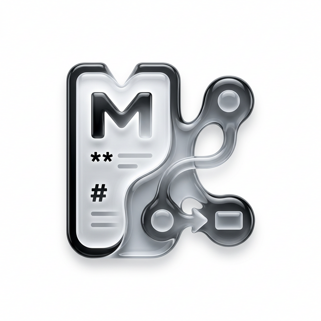 | [Markdown Text](https://github.com/bastndev/ATM) | Mejora markdown le agrega esteroides lo hace mas inteligente y se implementa nuchas funcones nuevas y modernas como previsualizacion de diagramas Mermaid integrada. | 12KB |

<details>
<summary>Tutorial VIDEO</summary>

<video controls autoplay muted loop src="./public/github/video/v-markdown-text.mp4" width="100%"></video>

</details>

|                                                                                    |                                                 |                                                                                                                            |      |
| ---------------------------------------------------------------------------------- | ----------------------------------------------- | -------------------------------------------------------------------------------------------------------------------------- | ---- |
| 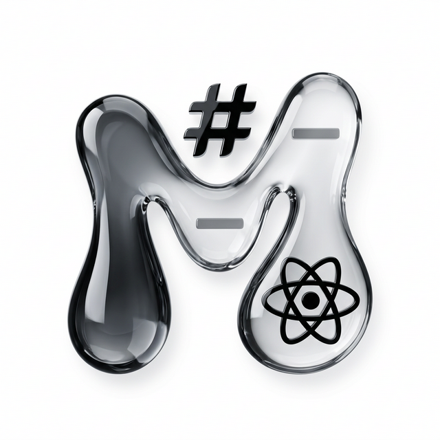 | [Markdown MDX](https://github.com/bastndev/ATM) | Soporte MDX con sintaxis y vista previa en vivo usando compilacion React/esbuild, con acceso rapido por `Shift + Alt + M`. | 12KB |

<details>
<summary>Tutorial VIDEO</summary>

<video controls autoplay muted loop src="./public/github/video/v-markdown-mdx.mp4" width="100%"></video>

</details>

|                                                                                       |                                                    |                                                                                            |      |
| ------------------------------------------------------------------------------------- | -------------------------------------------------- | ------------------------------------------------------------------------------------------ | ---- |
| 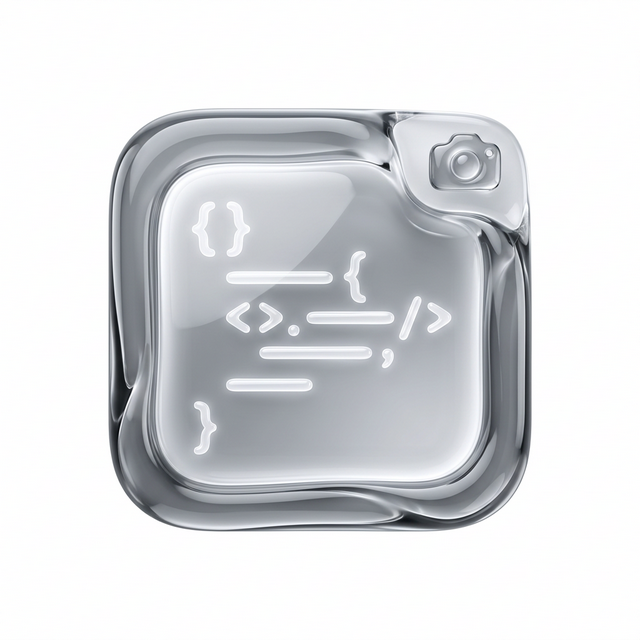 | [Screenshot Code](https://github.com/bastndev/ATM) | Genera capturas de fragmentos de codigo con estilos de presentacion listos para compartir. | 12KB |

<details>
<summary>Tutorial VIDEO</summary>

<video controls autoplay muted loop src="./public/github/video/v-screenshot-code.mp4" width="100%"></video>

</details>

|                                                                                  |                                               |                                                                                          |      |
| -------------------------------------------------------------------------------- | --------------------------------------------- | ---------------------------------------------------------------------------------------- | ---- |
| 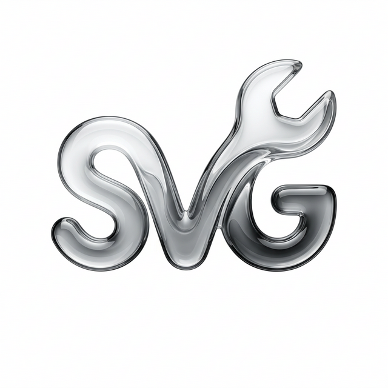 | [SVG Better](https://github.com/bastndev/ATM) | Mejora el trabajo con SVG mediante vista dividida automatica y optimizacion de archivos. | 12KB |

<details>
<summary>Tutorial VIDEO</summary>

<video controls autoplay muted loop src="./public/github/video/v-svg-better.mp4" width="100%"></video>

</details>

|                                                                                     |                                                  |                                                                                                                                |      |
| ----------------------------------------------------------------------------------- | ------------------------------------------------ | ------------------------------------------------------------------------------------------------------------------------------ | ---- |
| 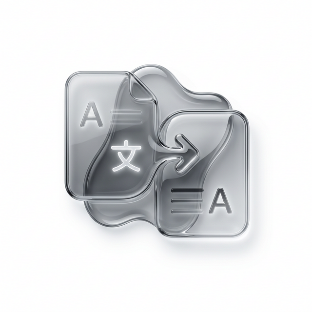 | [Translate Doc](https://github.com/bastndev/ATM) | Traduce documentacion y notas de version para mantener contenido tecnico en varios idiomas, con atajos `Ctrl + Shift + Space`. | 12KB |

<details>
<summary>Tutorial VIDEO</summary>

<video controls autoplay muted loop src="./public/github/video/v-translate-doc.mp4" width="100%"></video>

</details>

|                                                                                       |                                                    |                                                                                                              |      |
| ------------------------------------------------------------------------------------- | -------------------------------------------------- | ------------------------------------------------------------------------------------------------------------ | ---- |
| 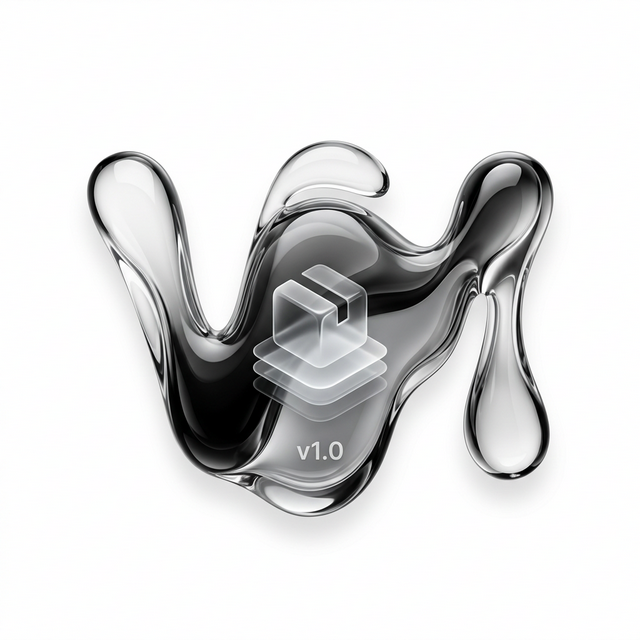 | [Version Package](https://github.com/bastndev/ATM) | Gestiona versiones en package.json con parser semantico, decoraciones y ayuda contextual al pasar el cursor. | 12KB |

<details>
<summary>Tutorial VIDEO</summary>

<video controls autoplay muted loop src="./public/github/video/v-version-package.mp4" width="100%"></video>

</details>

|                                                                                 |                                              |                                                                                                                                                                                    |      |
| ------------------------------------------------------------------------------- | -------------------------------------------- | ---------------------------------------------------------------------------------------------------------------------------------------------------------------------------------- | ---- |
| 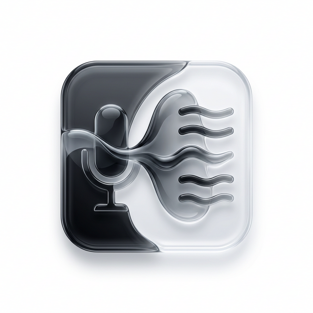 | [Voice TTS](https://github.com/bastndev/ATM) | Convierte texto a voz dentro de (tu editor preferido) con activacion, estado e interfaz de control, usando `Shift + Space` para leer y `Shift + Alt + Space` para seleccionar voz. | 12KB |

<details>
<summary>Tutorial VIDEO</summary>

<video controls autoplay muted loop src="./public/github/video/v-color-box.mp4" width="100%"></video>

</details>

|                                                                                 |                                              |                                                                                                              |       |
| ------------------------------------------------------------------------------- | -------------------------------------------- | ------------------------------------------------------------------------------------------------------------ | ----- |
| 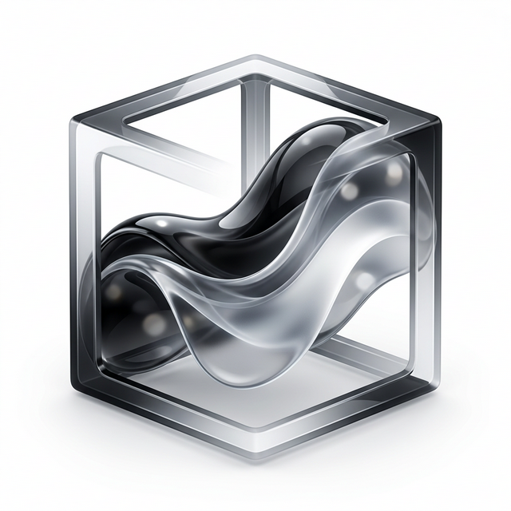 | [Color Box](https://github.com/bastndev/ATM) | Detecta y resalta colores inline en el editor para multiples formatos y lenguajes con renderizado eficiente. | 12KB  |
| TOTAL                                                                           | -                                            | -                                                                                                            | `1MB` |

---

<br>

### [+] `Settings` disable or enable

- **Cursor**: disable animation
- **breadcrumbs**: disable animation
- **files**: active animation

> **Note:** Keep your extensions updated regularly to get the latest features and security fixes.

<br>

---

## Installation

Launch _Quick Open_

-  Linux `Ctrl+P`
-  macOS `⌘P`
-  Windows `Ctrl+P`

Paste the following command and press `Enter`:

```
ext install bastndev.atm
```

## About Me

| [](https://gohit.xyz/me) |
| :-----------------------------------------------------------------------: |
|                     **[Gohit X](https://gohit.xyz)**                      |
|                          _Creator & Maintainer_                           |

- [🌱 IG](https://instagram.com/gohitx) **`new`** - Preview post in stories.
- 🔴 [Youtube](https://www.youtube.com/@gohitx?sub_confirmation=1) - Code, Software and development insights.
- 💼 [Linkedin](https://www.linkedin.com/in/gohitx) - Professional networking and career updates.

<br>

## Sponsors 

<div align="center"><table>
    <tr>
      <td align="center">
        
        <p>Celia A.</p>
      </td>
            <td align="center">
        
        <p>Octavio A.</p>
      </td>
            <td align="center">
        
        <p>Richar C.</p>
      </td>
            <td align="center">
        
        <p>Frank C.</p>
      </td>
      <td align="center">
        
        <p>M</p>
      </td>
    </tr>
  </table>
</div>

<p align="center">
  <em>Thank you to all our amazing sponsors! 💖</em><br>
  <a href="https://github.com/sponsors/bastndev">Become a sponsor</a>
</p>

<br>

<h2 align="center">
  Complement Extension 🧩
</h2>

<!-- ##   Complement Extension 🧩 -->

| Icon                                                                                                                                                                                                                                   | Name                                                           | Description                                                                                                                                                                                   |
| -------------------------------------------------------------------------------------------------------------------------------------------------------------------------------------------------------------------------------------- | -------------------------------------------------------------- | --------------------------------------------------------------------------------------------------------------------------------------------------------------------------------------------- |
| [](https://marketplace.visualstudio.com/items?itemName=bastndev.lynx-theme) | [Lynx Theme Pro](https://github.com/bastndev/Lynx-Theme)       | A professional extension with six available themes: Dark, Light, Night, Ghibli, Coffee, and Kiro—with integrated icons. Each theme is optimized to offer a more pleasant visual experience.   |
| [](https://marketplace.visualstudio.com/items?itemName=bastndev.lynx-keymap)                                      | [Lynx Keymap Pro](https://github.com/bastndev/Lynx-Keymap-Pro) | Standardizes keyboard shortcuts across all code editors, allowing you to use key combinations to access any functionality. It improves workflow and development experience.                   |
| [](https://marketplace.visualstudio.com/items?itemName=bastndev.lynxjs-pack)  | [LynxJS Pack](https://github.com/bastndev/LynxJs-Packge)       | An all-in-one toolkit for web and mobile development with LynxJS: includes keyboard shortcuts, error alerts, text correction, snippets, and more. Tools designed to streamline your workflow. |

<br>

<div align="center">
  
  **Enjoy 🎉 Your (ATM - Extension) are now installed!**  
  *If you find any bugs or have feedback, you can [open an issue](https://github.com/bastndev/atm/issues)*
</div>
