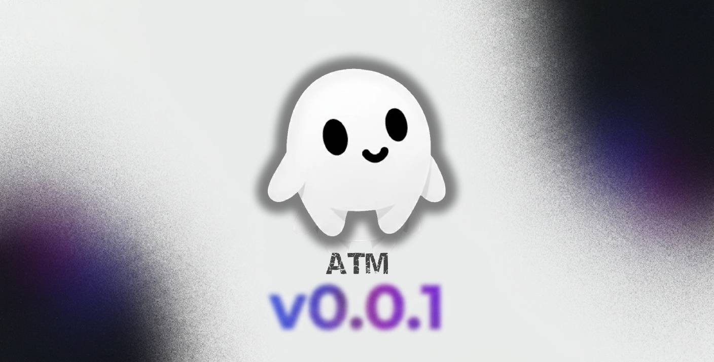

<p align="center">
  
</p>

<h1 align="center">ATM — Advanced Tool Module</h1>

<p align="center">
  <i>Una suite profesional y minimalista de extensiones modulares diseñada para potenciar el flujo de trabajo en VS Code.</i>
</p>

<p align="center">
  
  
  
</p>

---

## 💠 Galería de Extensiones (Core Modules)

|                                                        Icon                                                         | Code / Module     | Descripción                                                                                 |   Atributo   | Eficiencia |
| :-----------------------------------------------------------------------------------------------------------------: | :---------------- | :------------------------------------------------------------------------------------------ | :----------: | :--------: |
|       | `> Image Preview` | Previsualizaciones profesionales y miniaturas en el gutter para imágenes y SVGs.            |  **Visual**  |  `S-Tier`  |
|         | `> Voice TTS`     | Motor de texto a voz integrado para narración de código de alta fidelidad.                  | **Utilidad** |  `Veloz`   |
|        | `> Code Spell`    | Lógica avanzada de corrección ortográfica para bases de código modernas.                    | **Calidad**  |  `Nativo`  |
|         | `> Error Lens`    | Diagnósticos inline de ultra-baja latencia que proyectan errores directamente en el código. | **Guardia**  |  `Élite`   |
|  | `> Color Box`     | Sistema fluido de decoración de colores para visualización de CSS y Hex.                    |  **Diseño**  |  `Fluido`  |
|     | `> Anotaciones`   | Indexación inteligente de TODO/FIXME en todo el espacio de trabajo.                         |  **Flujo**   |   `Core`   |
|      | `> MDX Supreme`   | Soporte avanzado para MDX, traducciones automáticas y previsualizaciones.                   |  **Lógica**  |  `Smart`   |
|          | `> Git Better`    | Metadatos de line-blame profesionales e integración profunda con GitHub.                    |  **Social**  |  `Cloud`   |
|        | `> Screenshot`    | Captura de fragmentos de código en alta definición para presentaciones.                     | **Exportar** |   `Web`    |
|          | `> Versioning`    | Inspector dinámico de dependencias para `package.json` con lógica multi-proveedor.          | **Sistema**  |   `Auto`   |
|           | `> SVG Better`    | Pipeline de optimización SVG de alto rendimiento utilizando algoritmos SVGO.                |  **Asset**   |  `Nativo`  |
|          | `> Copy Tag`      | Sistema de feedback visual inmediato con micro-animaciones al copiar datos.                 |    **UX**    | `Instant`  |

---

## 🔱 Atributos de Maestro (Dota-Style)

Inspirado en sistemas de alto rendimiento, ATM segmenta sus capacidades en tres vectores primarios:

- **⚡ Eficiencia (Agilidad)**: Módulos como `SVG Better` y `Copy Tag` operan con latencia casi nula.
- **🛡️ Calidad (Fuerza)**: `Error Lens` y `Code Spell` proporcionan una capa defensiva robusta contra bugs.
- **🔮 Utilidad (Inteligencia)**: `Voice TTS` y `Image Preview` aumentan el rango cognitivo del desarrollador.

---

## ⚙️ Configuración (Mastery)

ATM está diseñado para ser **Zero-Config** desde el inicio. Sin embargo, los buscadores de la perfección pueden ajustar cada módulo en los ajustes globales.

```json
{
  "atm.image.preview.showUnderline": true,
  "atm.versionPackage.checkOnStartup": true,
  "atm.copyTag.timeout": 250
}
```

---

<p align="center">
  <i>Desarrollado con precisión por</i> <br>
  <b><a href="https://github.com/bastndev">Gohit X & (bastndev)</a></b>
</p>
