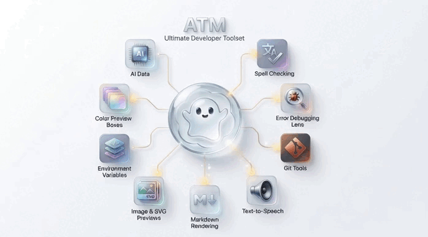

<div align="center">
  
</div>

<br>

<p align="center">
  <a href="https://marketplace.visualstudio.com/items?itemName=bastndev.atm"></a>&nbsp;
  <a href="https://marketplace.visualstudio.com/items?itemName=bastndev.atm"></a>&nbsp;
  <a href="https://marketplace.visualstudio.com/items?itemName=bastndev.atm"></a>&nbsp;
  <a href="https://github.com/bastndev/ATM"></a>
</p>

<p align="center">
  <a href="./public/docs/README_ES.md">Español 🇪🇸</a> |
  <a href="./public/docs/README_ZH.md">中文 🇨🇳</a>
</p>

<br>

| `Icon`                                                 | `Code/Name`                                     | `Description`                                                                                                                                                          | `SIZE` |
| ------------------------------------------------------ | ----------------------------------------------- | ---------------------------------------------------------------------------------------------------------------------------------------------------------------------- | ------ |
|  | [Compare Code](https://github.com/bastndev/ATM) | Lets you `Ctrl + C` code in a professional, fast, and clear way. With a modern and intuitive interface, it's ideal for developers looking to boost their productivity. | 12KB   |

<details>
<summary>Tutorial GIF</summary>



</details>

|                                                        |                                                 |                                                                                                                                                                       |      |
| ------------------------------------------------------ | ----------------------------------------------- | --------------------------------------------------------------------------------------------------------------------------------------------------------------------- | ---- |
|  | [Compare Code](https://github.com/bastndev/ATM) | Lets you `Alt + R` code in a professional, fast, and clear way. With a modern and intuitive interface, it's ideal for developers looking to boost their productivity. | 12KB |

<details>
<summary>Tutorial VIDEO</summary>

<video  loop start src="./public/github/video/v-test.mp4"></video>

</details>

|                                                        |                                                 |                                                                                                                                                                       |      |
| ------------------------------------------------------ | ----------------------------------------------- | --------------------------------------------------------------------------------------------------------------------------------------------------------------------- | ---- |
|  | [Compare Code](https://github.com/bastndev/ATM) | Lets you `compare` code in a professional, fast, and clear way. With a modern and intuitive interface, it's ideal for developers looking to boost their productivity. | 12KB |

<details>
<summary>Tutorial VIDEO 2</summary>

<video controller src="./public/github/video/v-test.mp4"></video>

</details>

|                                                                                                                                     |                                                                                                                                                                                |                                                                                                                                                                       |       |
| ----------------------------------------------------------------------------------------------------------------------------------- | ------------------------------------------------------------------------------------------------------------------------------------------------------------------------------ | --------------------------------------------------------------------------------------------------------------------------------------------------------------------- | ----- |
| [](https://marketplace.visualstudio.com/items?itemName=bastndev.compare-code) |  [Compare Code](https://github.com/bastndev/Compare-Code) | Lets you `compare` code in a professional, fast, and clear way. With a modern and intuitive interface, it's ideal for developers looking to boost their productivity. | 30KB  |
| TOTAL                                                                                                                               | -                                                                                                                                                                              | -                                                                                                                                                                     | `1MB` |

<br>

### [+] `Settings` disable or enable

- **Cursor**: disable animation
- **breadcrumbs**: disable animation
- **files**: active animation

> **Note:** Keep your extensions updated regularly to get the latest features and security fixes.

<br>

---

## Installation

Launch _Quick Open_

-  Linux `Ctrl+P`
-  macOS `⌘P`
-  Windows `Ctrl+P`

Paste the following command and press `Enter`:

```
ext install bastndev.atm
```

## About Me

| [](https://gohit.xyz/me) |
| :-----------------------------------------------------------------------: |
|                     **[Gohit X](https://gohit.xyz)**                      |
|                          _Creator & Maintainer_                           |

- [🌱 IG](https://instagram.com/gohitx) **`new`** - Preview post in stories.
- 🔴 [Youtube](https://www.youtube.com/@gohitx?sub_confirmation=1) - Code, Software and development insights.
- 💼 [Linkedin](https://www.linkedin.com/in/gohitx) - Professional networking and career updates.

<br>

## Sponsors 💗

<div align="center"><table>
    <tr>
      <td align="center">
        
        <p>Celia A.</p>
      </td>
            <td align="center">
        
        <p>Octavio A.</p>
      </td>
            <td align="center">
        
        <p>Richar C.</p>
      </td>
            <td align="center">
        
        <p>Frank C.</p>
      </td>
      <td align="center">
        
        <p>M</p>
      </td>
    </tr>
  </table>
</div>

<p align="center">
  <em>Thank you to all our amazing sponsors! 💖</em><br>
  <a href="https://github.com/sponsors/bastndev">Become a sponsor</a>
</p>

<br>

<h2 align="center">
  Complement Extension 🧩
</h2>

<!-- ##   Complement Extension 🧩 -->

| Icon                                                                                                                                                                                                                                   | Name                                                           | Description                                                                                                                                                                                   |
| -------------------------------------------------------------------------------------------------------------------------------------------------------------------------------------------------------------------------------------- | -------------------------------------------------------------- | --------------------------------------------------------------------------------------------------------------------------------------------------------------------------------------------- |
| [](https://marketplace.visualstudio.com/items?itemName=bastndev.lynx-theme) | [Lynx Theme Pro](https://github.com/bastndev/Lynx-Theme)       | A professional extension with six available themes: Dark, Light, Night, Ghibli, Coffee, and Kiro—with integrated icons. Each theme is optimized to offer a more pleasant visual experience.   |
| [](https://marketplace.visualstudio.com/items?itemName=bastndev.lynx-keymap)                                      | [Lynx Keymap Pro](https://github.com/bastndev/Lynx-Keymap-Pro) | Standardizes keyboard shortcuts across all code editors, allowing you to use key combinations to access any functionality. It improves workflow and development experience.                   |
| [](https://marketplace.visualstudio.com/items?itemName=bastndev.lynxjs-pack)  | [LynxJS Pack](https://github.com/bastndev/LynxJs-Packge)       | An all-in-one toolkit for web and mobile development with LynxJS: includes keyboard shortcuts, error alerts, text correction, snippets, and more. Tools designed to streamline your workflow. |

<br>

<div align="center">
  
  **Enjoy 🎉 Your (ATM - Extension) are now installed!**  
  *If you find any bugs or have feedback, you can [open an issue](https://github.com/bastndev/atm/issues)*
</div>
