<div align="center">
	
</div>

<p align="center">
	&nbsp;
	&nbsp;
	&nbsp;
	<a href="https://github.com/bastndev/ATM"></a>
</p>

<p align="center">
	<a href="https://github.com/bastndev/ATM/blob/main/README.md">English 🇺🇸</a> |
	<a href="https://github.com/bastndev/ATM/blob/main/public/docs/README_ES.md">Español 🇪🇸</a>
</p>

<div align="center">
	<h3>🏧 超过 16 个扩展与配置，开箱即用。</h3>
	<p>
		<strong>ATM</strong> 是一款面向 VS Code 的一体化扩展，将 16 个独立工具整合为一个统一且精美的工具包。从行内拼写检查与智能 <code>.env</code> 安全保护，到高质量代码截图与高级 Git 工具，你需要的都在这里，不需要的一个都没有。
	</p>
</div>

<br>

<table width="100%">
	<thead>
		<tr>
			<th width="19%" align="center">图标</th>
			<th width="16%" align="center">名称</th>
			<th width="56%">描述</th>
			<th width="14%" align="center">体积</th>
		</tr>
	</thead>
	<tbody>
		<tr>
			<td align="center"></td>
			<td align="center"><a href="https://github.com/bastndev/ATM"><b>AI Data</b></a></td>
			<td>实时监控并展示 AI（Antigravity）数据消耗，提供信息丰富的悬浮提示。</td>
			<td align="center"><b>56KB</b></td>
		</tr>
		<tr>
			<td colspan="4">
				<details>
					<summary><b>预览 — AI Data</b></summary>
					<br>
					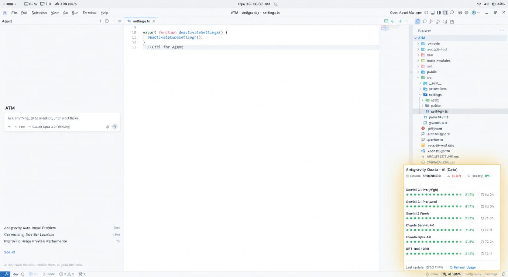
				</details>
			</td>
		</tr>
		<tr>
			<td align="center"></td>
			<td align="center"><a href="https://github.com/bastndev/ATM"><b>Code Spell</b></a></td>
			<td>面向代码的拼写检查器，内置英文词典、技术术语、快速修复与可配置排除项。</td>
			<td align="center"><b>156KB</b></td>
		</tr>
		<tr>
			<td colspan="4">
				<details>
					<summary><b>预览 — Code Spell</b></summary>
					<br>
					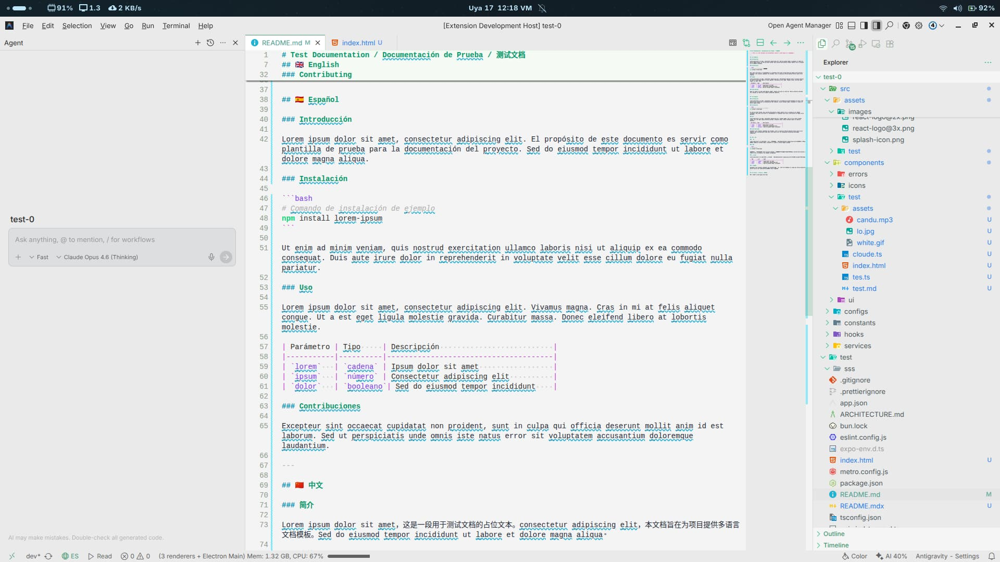
				</details>
			</td>
		</tr>
		<tr>
			<td align="center"></td>
			<td align="center"><a href="https://github.com/bastndev/ATM"><b>Color Debugging</b></a></td>
			<td>可视化颜色调试工具，包含状态管理与底部栏集成控制。</td>
			<td align="center"><b>28KB</b></td>
		</tr>
		<tr>
			<td colspan="4">
				<details>
					<summary><b>预览 — Color Debugging</b></summary>
					<br>
					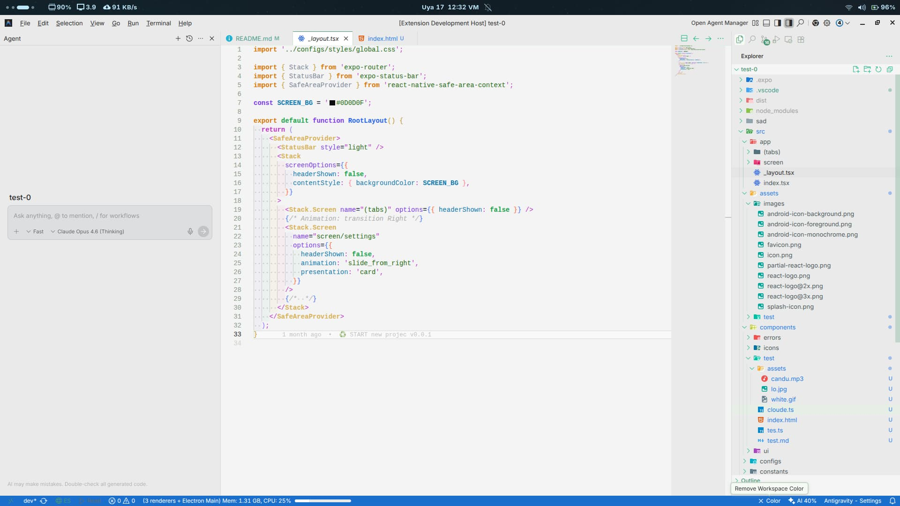
				</details>
			</td>
		</tr>
		<tr>
			<td align="center"></td>
			<td align="center"><a href="https://github.com/bastndev/ATM"><b>Comments Code</b></a></td>
			<td>通过可视化装饰、语言控制与优化渲染提升注释可读性。<code>TODO:</code> / <code>FIXME:</code> / <code>MARK:</code></td>
			<td align="center"><b>44KB</b></td>
		</tr>
		<tr>
			<td colspan="4">
				<details>
					<summary><b>预览 — Comments Code</b></summary>
					<br>
					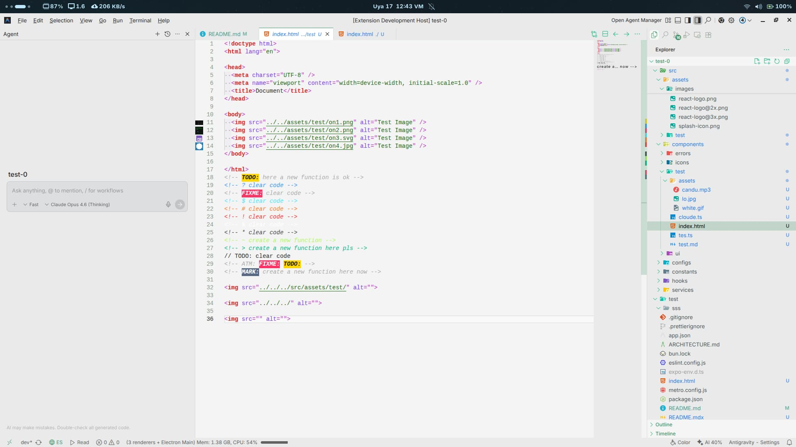
				</details>
			</td>
		</tr>
		<tr>
			<td align="center"></td>
			<td align="center"><a href="https://github.com/bastndev/ATM"><b>Env Lens</b></a></td>
			<td>安全解析 <code>.env</code> 文件，并通过 BLUR（临时隐藏/显示）结合装饰器与悬浮交互隐藏敏感值。</td>
			<td align="center"><b>32KB</b></td>
		</tr>
		<tr>
			<td colspan="4">
				<details>
					<summary><b>预览 — Env Lens</b></summary>
					<br>
					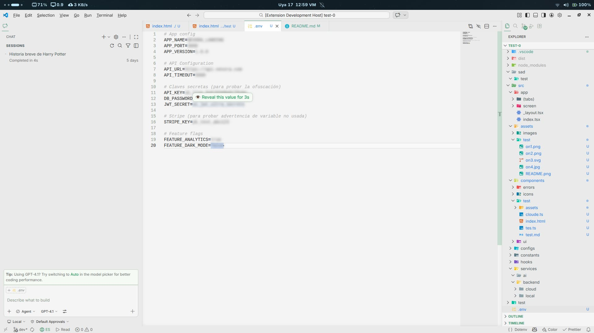
				</details>
			</td>
		</tr>
		<tr>
			<td align="center"></td>
			<td align="center"><a href="https://github.com/bastndev/ATM"><b>Error Lens</b></a></td>
			<td>在编辑器中直接行内显示错误与警告，加速诊断发现与修复。</td>
			<td align="center"><b>28KB</b></td>
		</tr>
		<tr>
			<td colspan="4">
				<details>
					<summary><b>预览 — Error Lens</b></summary>
					<br>
					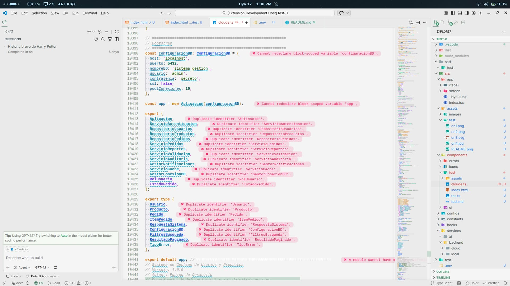
				</details>
			</td>
		</tr>
		<tr>
			<td align="center"></td>
			<td align="center"><a href="https://github.com/bastndev/ATM"><b>Git Better</b></a></td>
			<td>增强版 Git 面板，包含迷你 blame 视图与精美可视化工具，用于审查仓库历史与变更。</td>
			<td align="center"><b>368KB</b></td>
		</tr>
		<tr>
			<td colspan="4">
				<details>
					<summary><b>预览 — Git Better</b></summary>
					<br>
					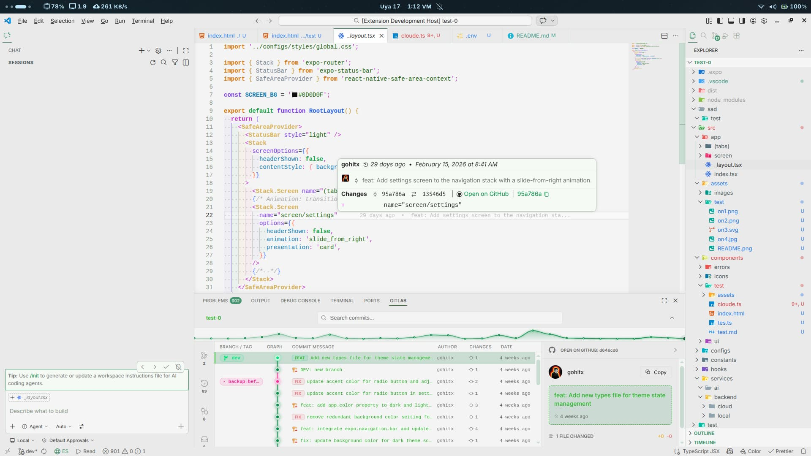
				</details>
			</td>
		</tr>
		<tr>
			<td align="center"></td>
			<td align="center"><a href="https://github.com/bastndev/ATM"><b>Image Preview</b></a></td>
			<td>在代码编辑器中直接行内预览图片，并显示尺寸与文件大小。</td>
			<td align="center"><b>56KB</b></td>
		</tr>
		<tr>
			<td colspan="4">
				<details>
					<summary><b>预览 — Image Preview</b></summary>
					<br>
					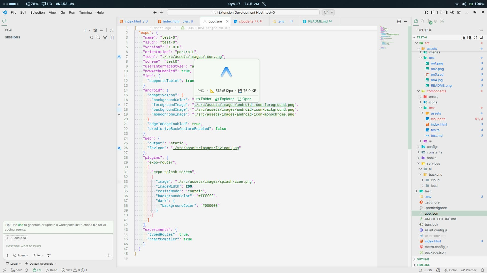
				</details>
			</td>
		</tr>
		<tr>
			<td align="center"></td>
			<td align="center"><a href="https://github.com/bastndev/ATM"><b>Markdown Text</b></a></td>
			<td>强化你的 Markdown 体验，提供更智能的现代功能，如内置 Mermaid 图表预览。</td>
			<td align="center"><b>52KB</b></td>
		</tr>
		<tr>
			<td colspan="4">
				<details>
					<summary><b>预览 — Markdown Text</b></summary>
					<br>
					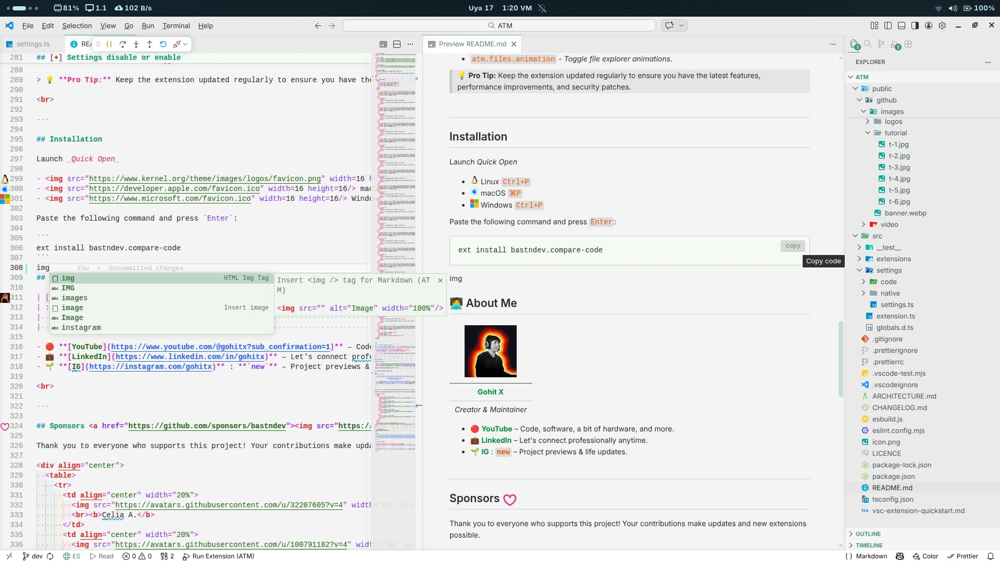
				</details>
			</td>
		</tr>
		<tr>
			<td align="center"></td>
			<td align="center"><a href="https://github.com/bastndev/ATM"><b>Markdown MDX</b></a></td>
			<td>完整支持 MDX 语法，并通过 React/esbuild 编译实现实时预览。快捷键：<code>Shift + Alt + M</code>。</td>
			<td align="center"><b>400KB</b></td>
		</tr>
		<tr>
			<td colspan="4">
				<details>
					<summary><b>预览 — Markdown MDX</b></summary>
					<br>
					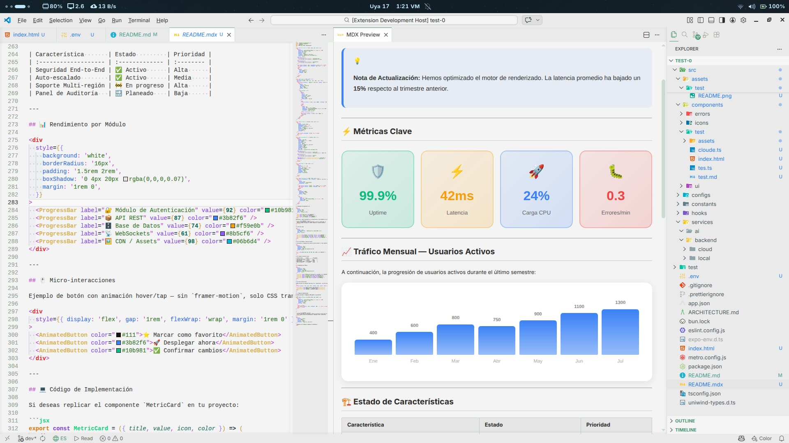
				</details>
			</td>
		</tr>
		<tr>
			<td align="center"></td>
			<td align="center"><a href="https://github.com/bastndev/ATM"><b>Screenshot Code</b></a></td>
			<td>生成令人惊艳的代码截图，提供可直接分享到社交平台的展示样式。</td>
			<td align="center"><b>100KB</b></td>
		</tr>
		<tr>
			<td colspan="4">
				<details>
					<summary><b>预览 — Screenshot Code</b></summary>
					<br>
					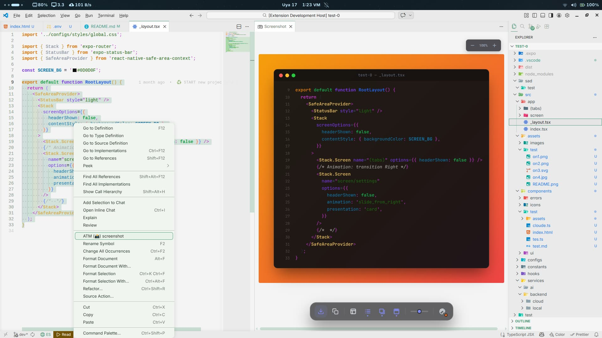
				</details>
			</td>
		</tr>
		<tr>
			<td align="center"></td>
			<td align="center"><a href="https://github.com/bastndev/ATM"><b>SVG Better</b></a></td>
			<td>通过自动分屏预览与内置优化功能，全面提升你的 SVG 工作流。</td>
			<td align="center"><b>12KB</b></td>
		</tr>
		<tr>
			<td colspan="4">
				<details>
					<summary><b>预览 — SVG Better</b></summary>
					<br>
					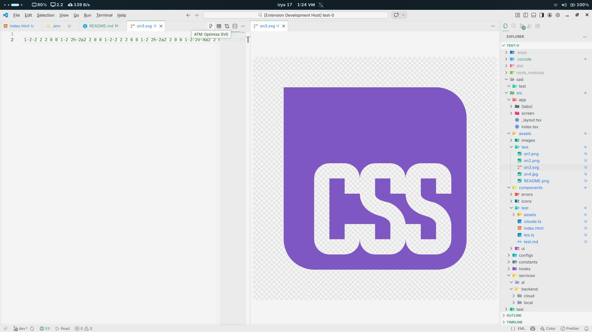
				</details>
			</td>
		</tr>
		<tr>
			<td align="center"></td>
			<td align="center"><a href="https://github.com/bastndev/ATM"><b>Translate Doc</b></a></td>
			<td>在编辑器内原生翻译文档与发行说明，快捷键：<code>Ctrl + Shift + Space</code>。</td>
			<td align="center"><b>56KB</b></td>
		</tr>
		<tr>
			<td colspan="4">
				<details>
					<summary><b>预览 — Translate Doc</b></summary>
					<br>
					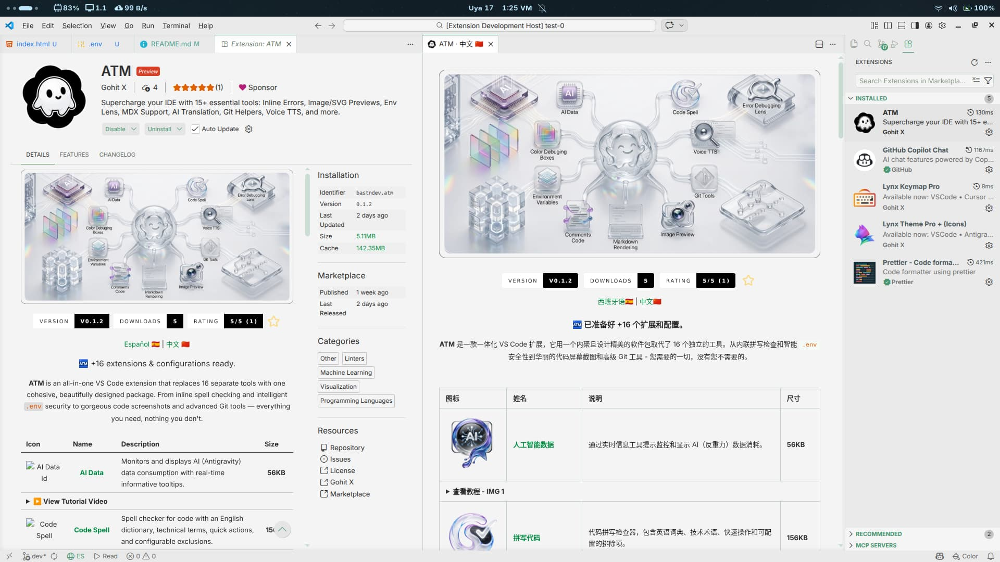
				</details>
			</td>
		</tr>
		<tr>
			<td align="center"></td>
			<td align="center"><a href="https://github.com/bastndev/ATM"><b>Version Package</b></a></td>
			<td>在 <code>package.json</code> 中流畅管理版本，支持语义解析、悬浮状态与装饰器。</td>
			<td align="center"><b>56KB</b></td>
		</tr>
		<tr>
			<td colspan="4">
				<details>
					<summary><b>预览 — Version Package</b></summary>
					<br>
					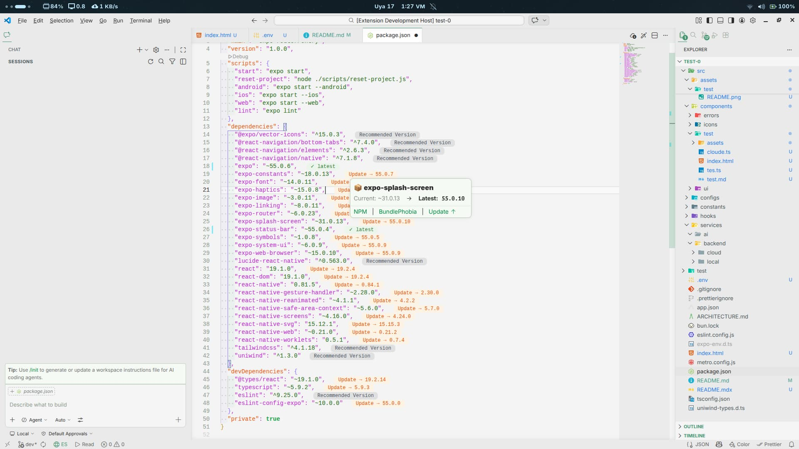
				</details>
			</td>
		</tr>
		<tr>
			<td align="center"></td>
			<td align="center"><a href="https://github.com/bastndev/ATM"><b>Voice TTS</b></a></td>
			<td>在编辑器内直接朗读文本。使用 <code>Shift + Space</code> 朗读，使用 <code>Shift + Alt + Space</code> 选择语音。</td>
			<td align="center"><b>80KB</b></td>
		</tr>
		<tr>
			<td colspan="4">
				<details>
					<summary><b>预览 — Voice TTS</b></summary>
					<br>
					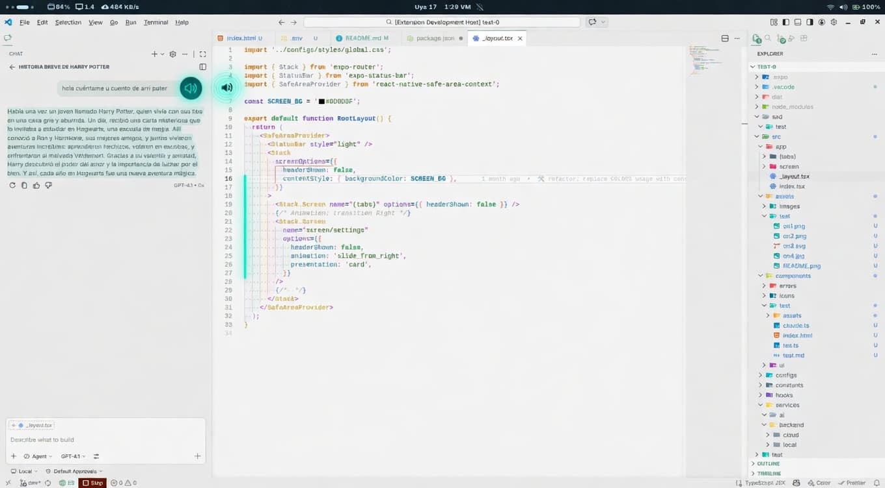
				</details>
			</td>
		</tr>
		<tr>
			<td align="center"></td>
			<td align="center"><a href="https://github.com/bastndev/ATM"><b>Color Box</b></a></td>
			<td>针对多种现代 Web 格式提供极速行内颜色检测与高亮。</td>
			<td align="center"><b>20KB</b></td>
		</tr>
		<tr>
			<td colspan="4">
				<details>
					<summary><b>预览 — Color Box</b></summary>
					<br>
					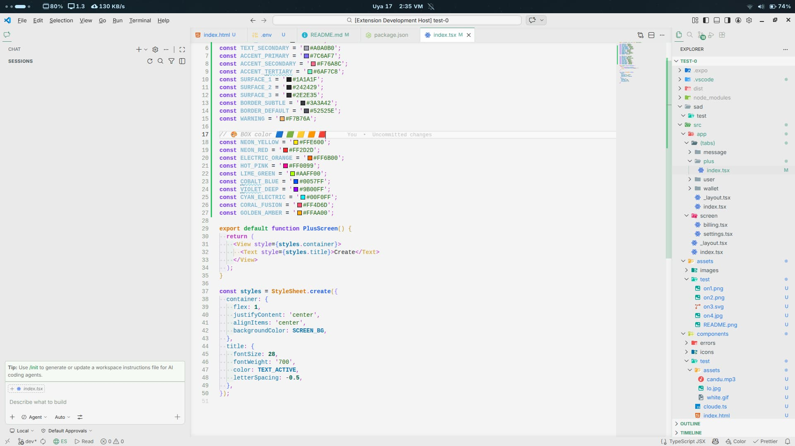
				</details>
			</td>
		</tr>
		<tr>
			<td align="center">16</td>
			<td align="center"><b>🧩</b></td>
			<td>全部打包为一个轻量扩展。</td>
			<td align="center"><b><code>1.5MB</code></b></td>
		</tr>
	</tbody>
</table>

---

<br>

## [+] 设置开关

你可以直接在 VS Code 设置中自定义 ATM 的行为，按你的偏好精细调整体验：

- `atm.cursor.animation` - _启用或禁用光标动画。_
- `atm.breadcrumbs.animation` - _启用或禁用面包屑路径动画。_
- `atm.files.animation` - _启用或禁用文件资源管理器动画。_

> 💡 **专业提示：** 请定期更新扩展，以获得最新功能、性能优化与安全补丁。

<br>

---

## 安装

打开 _Quick Open_

-  Linux `Ctrl+P`
-  macOS `⌘P`
-  Windows `Ctrl+P`

粘贴以下命令并按 `Enter`：

```
ext install bastndev.atm
```

## 🧑‍💻 关于我

| [](https://gohit.xyz/me) |
| :-----------------------------------------------------------------------: |
|                     **[Gohit X](https://gohit.xyz)**                      |
|                              _作者与维护者_                               |

- 🔴 **[YouTube](https://www.youtube.com/@gohitx?sub_confirmation=1)** – 编程、软件、一些硬件内容等。
- 💼 **[LinkedIn](https://www.linkedin.com/in/gohitx)** – 欢迎随时进行职业交流。
- 🌱 **[IG](https://instagram.com/gohitx)** : **`new`** – 项目预览与生活更新。

<br>

---

## 赞助者 <a href="https://github.com/sponsors/bastndev"></a>

感谢所有支持本项目的朋友！你们的贡献让更新与新扩展成为可能。

<div align="center">
	<table>
		<tr>
			<td align="center" width="20%">
				
				<br><b>Celia A.</b>
			</td>
			<td align="center" width="20%">
				
				<br><b>Octavio A.</b>
			</td>
			<td align="center" width="20%">
				
				<br><b>Richar C.</b>
			</td>
			<td align="center" width="20%">
				<a href="https://github.com/ffrank123">
					
					<br><b>Frank C.</b>
				</a>
			</td>
			<td align="center" width="20%">
				
				<br><b>M</b>
			</td>
		</tr>
	</table>
	<br>
	<em>感谢所有超棒的赞助者！✨</em><br>
	<a href="https://github.com/sponsors/bastndev"><b>👉 成为赞助者</b></a>
</div>

<br>

<h2 align="center">
	🧩 补充扩展
</h2>

| 图标                                                                                                                                                                                                                                       | 扩展                                                              | 描述                                                                                                                                                                 |
| ------------------------------------------------------------------------------------------------------------------------------------------------------------------------------------------------------------------------------------------ | ----------------------------------------------------------------- | -------------------------------------------------------------------------------------------------------------------------------------------------------------------- |
| [](https://marketplace.visualstudio.com/items?itemName=bastndev.lynx-theme)   | **[Lynx Theme Pro](https://github.com/bastndev/Lynx-Theme)**      | 专业且时尚的主题包，含 6 种视觉变体（Dark、Light、Night、Ghibli、Coffee、Kiro）并集成图标。                                                                        |
| [](https://marketplace.visualstudio.com/items?itemName=bastndev.lynx-keymap)                                        | **[Lynx Keymap Pro](https://github.com/bastndev/Lynx-Keymap-Pro)** | 统一所有代码编辑器快捷键标准，最大化肌肉记忆并显著提升工作流效率。                                                                                                   |
| [](https://marketplace.visualstudio.com/items?itemName=bastndev.compare-code) | [Compare Code](https://github.com/bastndev/Compare-Code)          | 让你以专业、快速、清晰的方式比较代码。配合现代直观界面，非常适合希望提升效率的开发者。                                                                                |

<br>

<div align="center">
  
	**尽情享受 🎉 你的 (ATM - Extension) 已安装完成！**  
	*如果你发现 Bug 或有反馈，欢迎 [提交 issue](https://github.com/bastndev/atm/issues)*

	<br>

<sub>由 <a href="https://gohit.xyz">Gohit X</a> 用 ❤️ 打造 · 采用 <a href="../../LICENCE">MIT</a> 许可</sub>

</div>
